# Accessibility 

## Benefits of accessibility and SEO

1. More people can access your content
2. A brave ne wworld of devices open for new possibilities 
3. Content is easier to read and understand 
4. Cleaner, more semantic markup
5. Increases `findability` in serach engines 
6. Increases `shareability` on social networks

## Basic rules 
[Youtube - Accessible Web Design: What Is It & How To Do It](https://www.youtube.com/watch?v=-ao_Kc_8rpE)

1. Color contrast and Text size  - MDS Contrast tool macOs app
2. Design focus state
3. Form labels
4. Alt tags with Images 
5. Develop Correctly 

## Tools to check accessibility
1. Wave chrome extension 
2. AA checker 
3. Color extension
4. Axe node package 

## Google Accessibility resources 

[Refrence link](https://www.youtube.com/watch?v=HtTyRajRuyY&list=PLNYkxOF6rcICWx0C9LVWWVqvHlYJyqw7g&index=31) 

[Youtube - Accessible Web Design: What Is It & How To Do It](https://www.youtube.com/watch?v=-ao_Kc_8rpE)

[Google Accessibility tutorial](https://github.com/jkup/learn-a11y)

[Google  - Accessibility Fundamentals with Rob Dodson] (https://www.youtube.com/watch?v=z8xUCzToff8)

[Youtube sries on Web Accessibility](https://www.youtube.com/watch?v=g9Qff0b-lHk&list=PLNYkxOF6rcICWx0C9LVWWVqvHlYJyqw7g)

[Udacity course - Web accessibility by Google](https://www.udacity.com/course/web-accessibility--ud891)

[Accessibility fundamentals](https://developers.google.com/web/fundamentals/accessibility/)

## Accessibility Notes 

1. Screen reader access 

    1.1.  Affordances  
      - Affordances offer or Affordances a person the opportunity to perform an action. 
      - Goal - Offer Affordances so non-sighted users can access our content.

    1.2. How does Chrome communicate with a sceen reader ?

      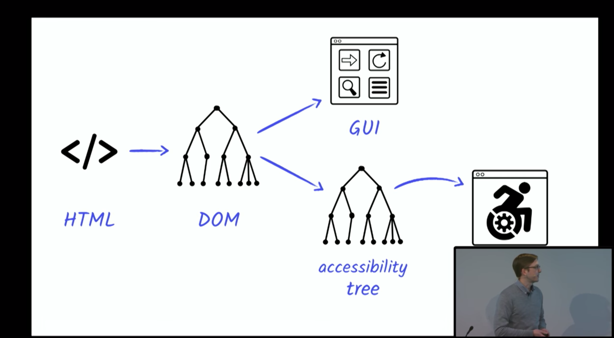 
      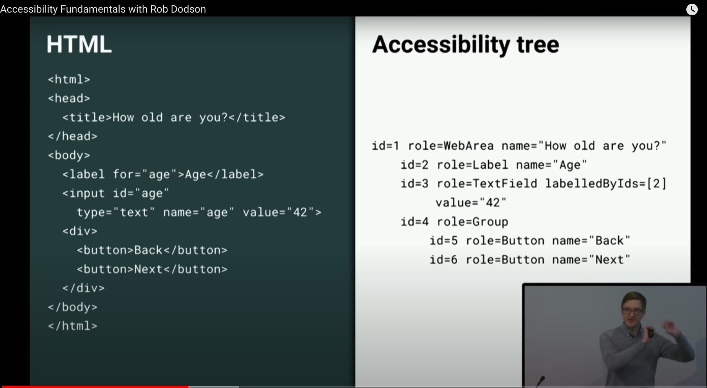 
      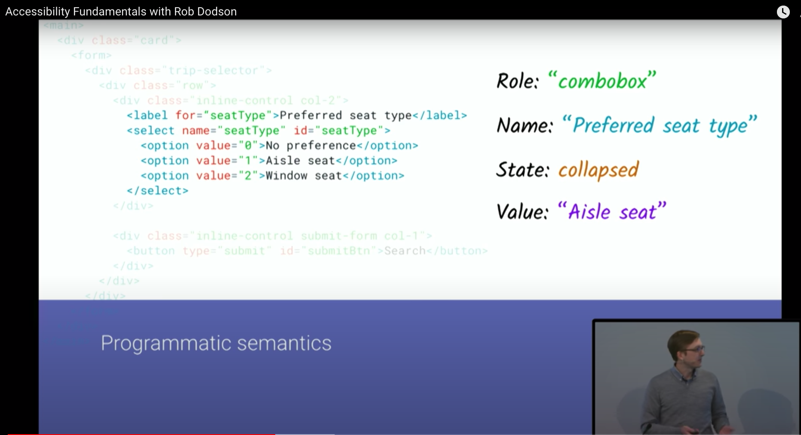 
      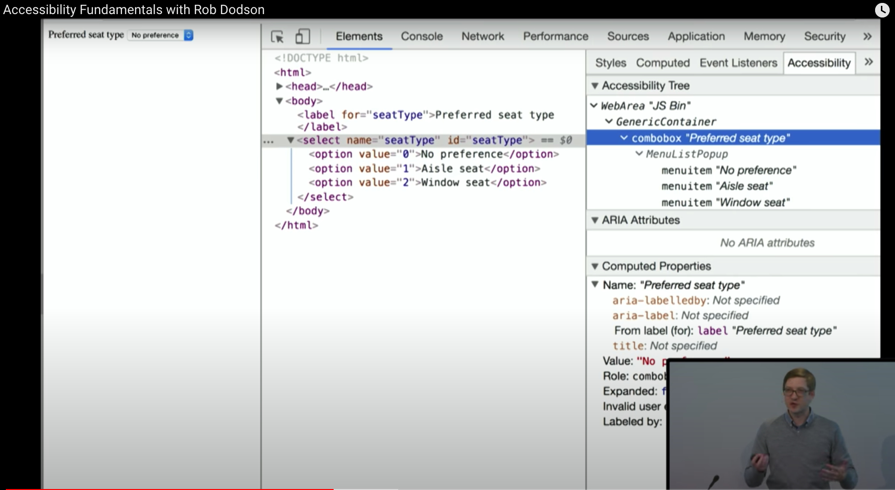 
      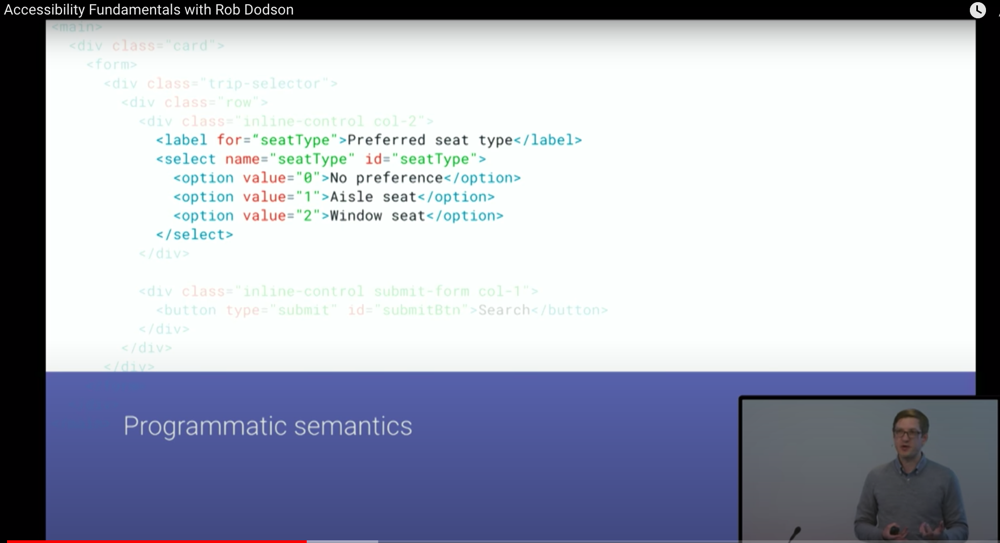 

    1.3. Use Implicit Semantics 
        - Similar to focus, native elements get rich semantics for free.
        - Examples 
          a. texfield
          b. button
          c. combobox 

    1.4. Landmarks
      - Some elements act as landmarks. Screen readers can quickly jump to these sections on the page.
      - Examples 
        a. <h1> ... <h6>
        b. <main>
        c. <nav>
        d. <footer>

  

    1.5. Example site 
  
  [https://webaim.org/](https://webaim.org/)

    1.6. Generic elements have generic sementics

  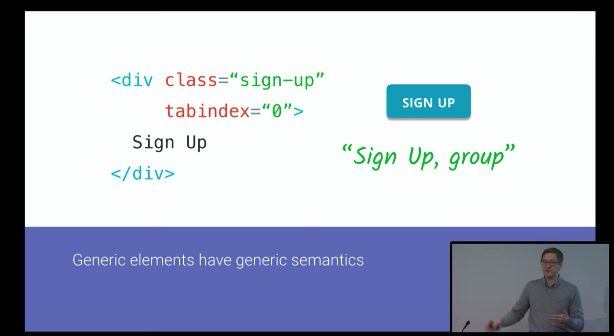 

    1.7. Don't make your life hard - Use the right element for the job

  
2 `WAI- ARIA`
  
  The Web accessibility initiative - Accessible Rich Internet Applications (ARIA) specifications adds the ability to `modify and enhance the semantic meaning` of elements in the DOM.

2.1. ARIA does not change behavior 

2.2. ARIA lets you fill in gaps in the accessibility tree.

2.3. ARIA place 

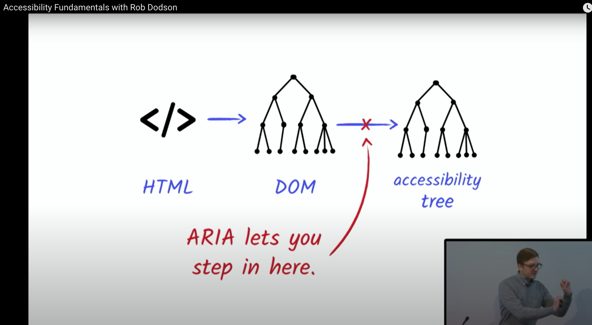 

2.4. [How do I learn ARIA ?](https://www.w3.org/TR/wai-aria-practices-1.1/)

2.5 `<lable>` helps users understand the purpose of a control.

  `<label>` Control must be a child of <label> or targeted by an `IDRef` using the label's `for=""` attribute. Only works with native form elements.

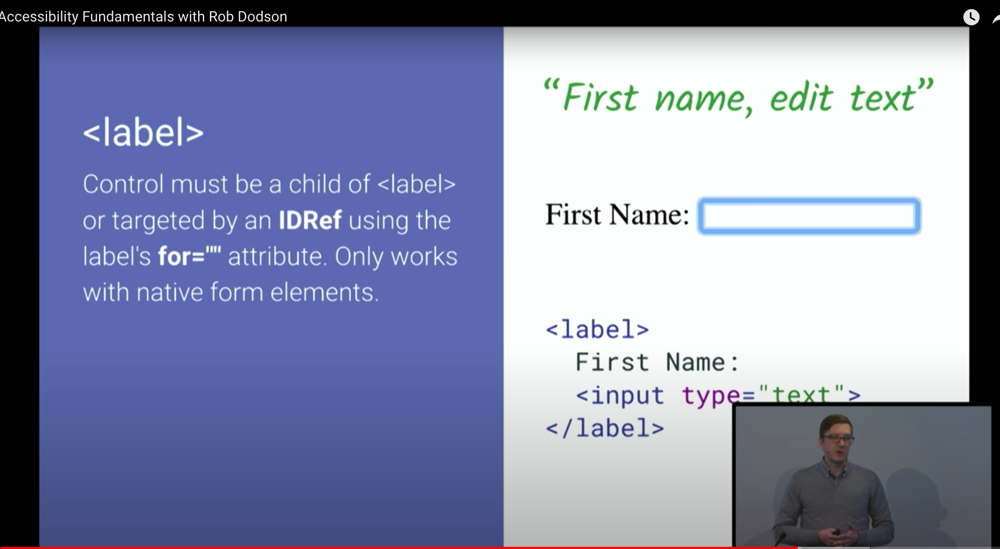 

  `<aria-label>` - A string to be used as the accessible label. Overrides any other native labelling mechanism.

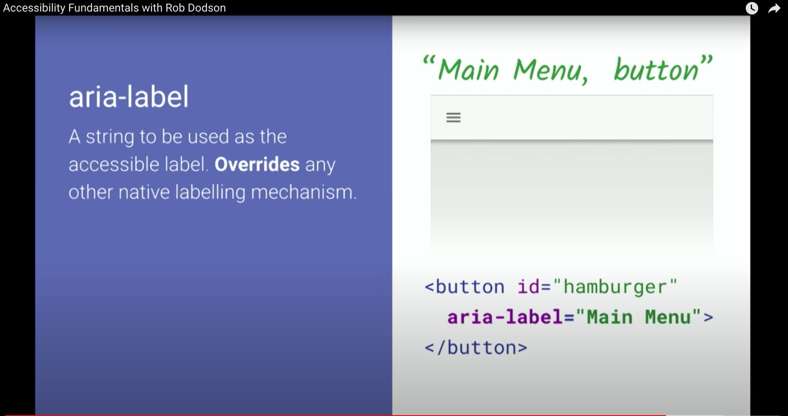 

`<aria-labelledby>` - A refrence to an element (or elements) which will act as an accessible label. Overrides any other labelling mechanism including aria-label.

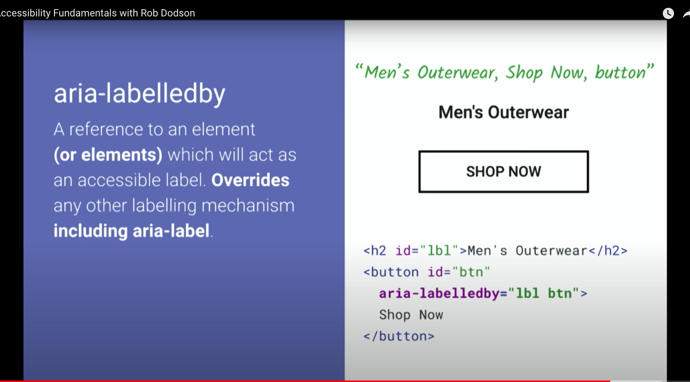 

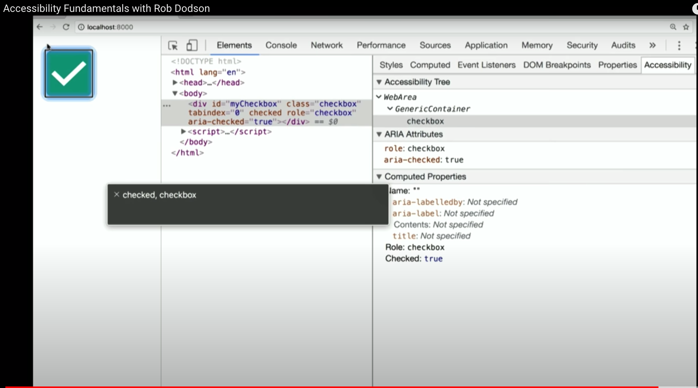 

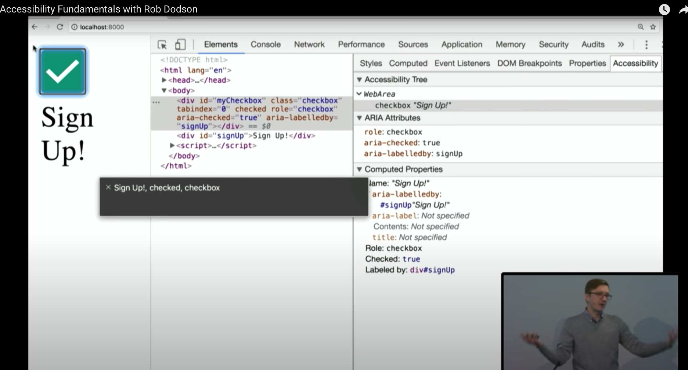 

